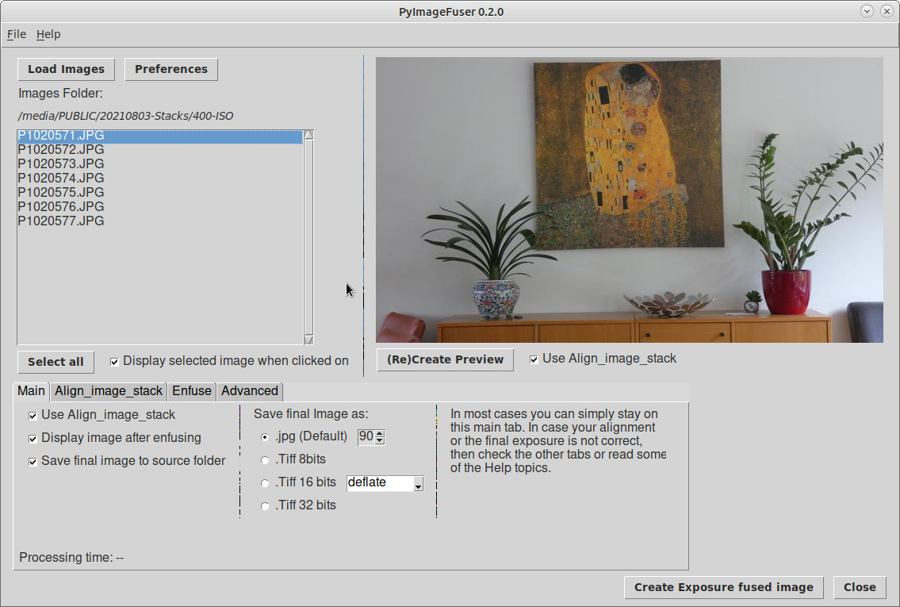
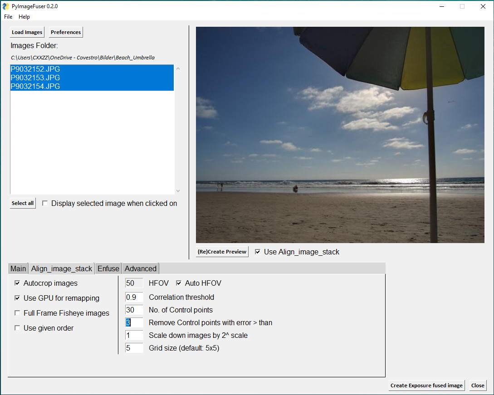
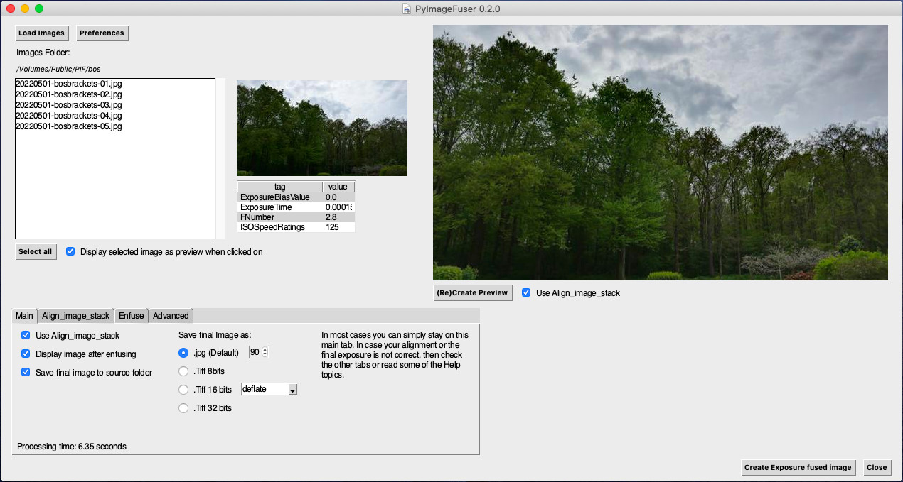
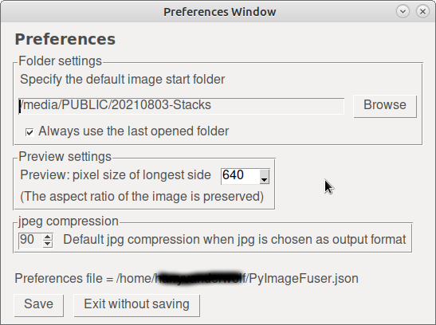
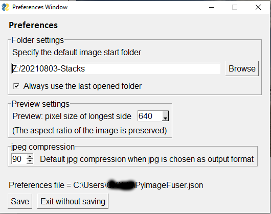
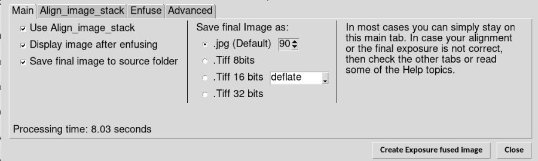
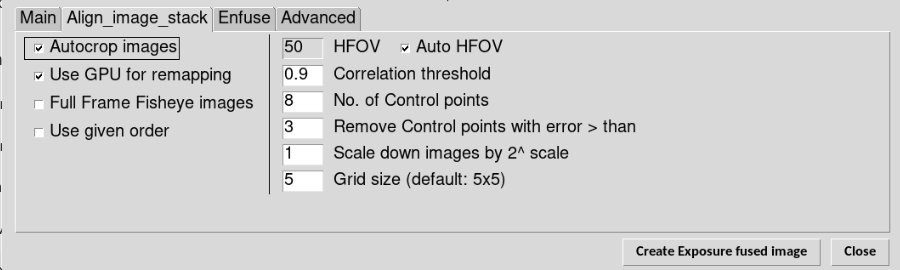
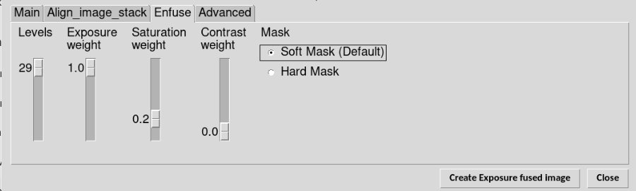
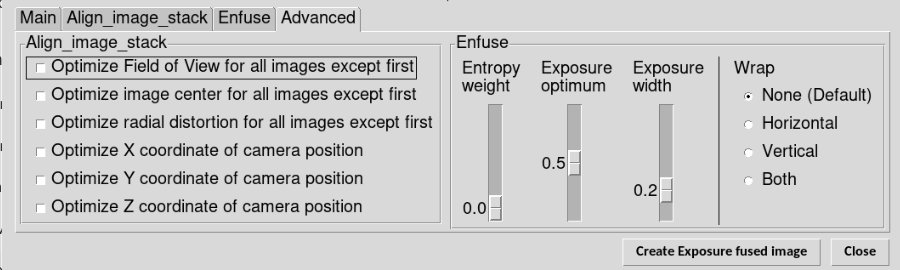

# Screenshots

## Main screen

**Linux XFCE4 bluementa theme**  
  

**Windows 10**  
  

**MacOS**  
  

## Preferences

**Linux XFCE4**  
  

**Windows 10**  

**Parameters tabs**  
  
  
  
  
